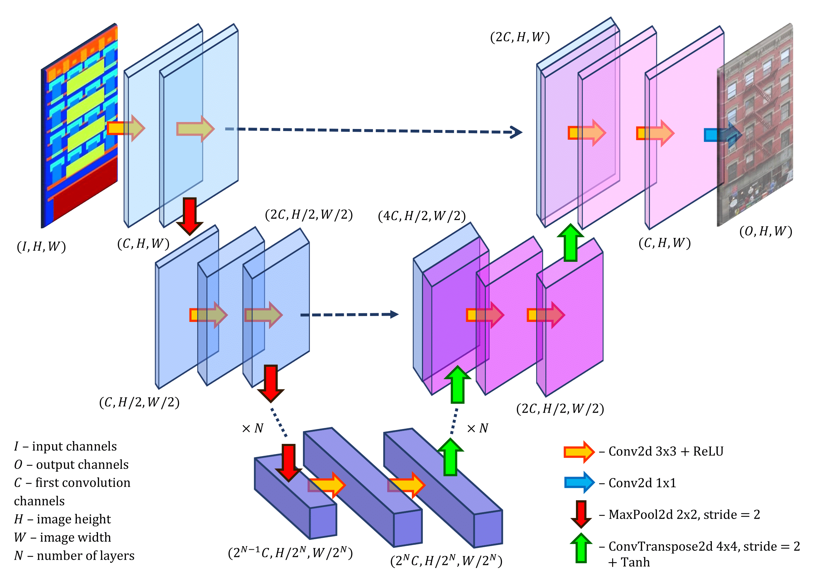
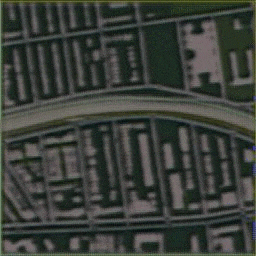
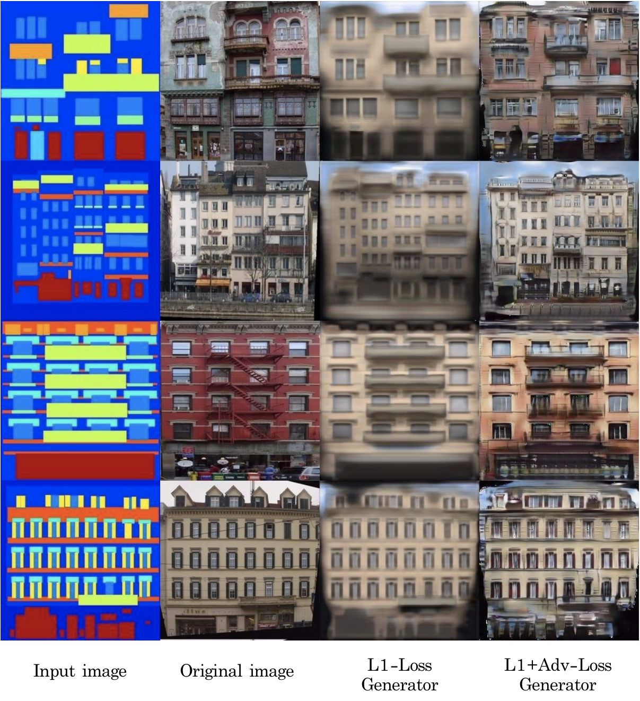
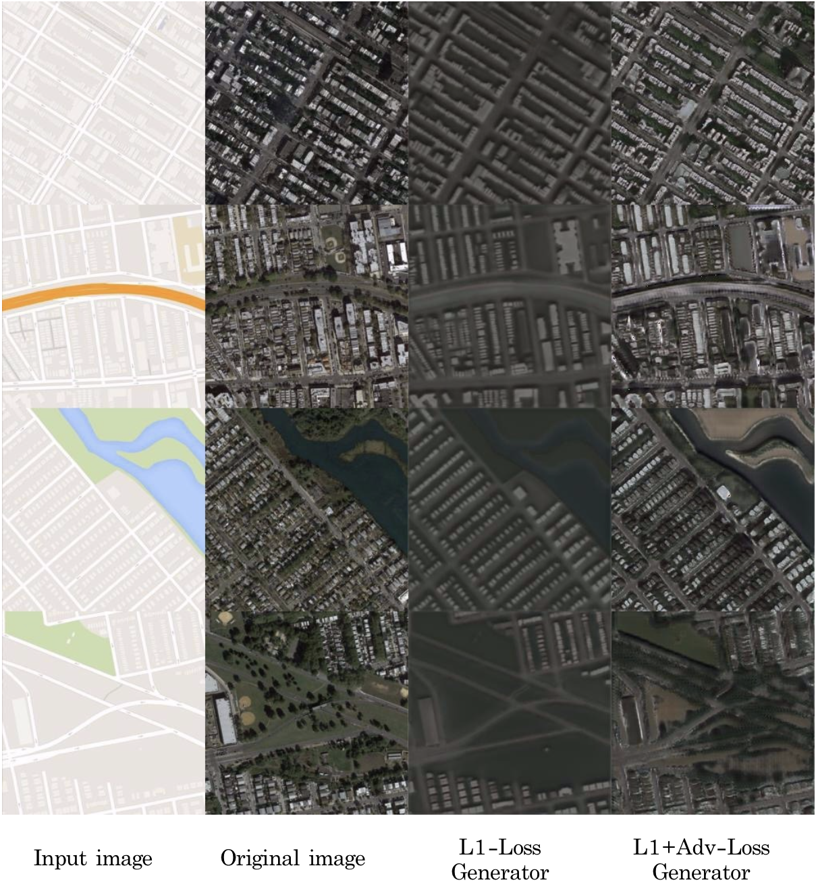
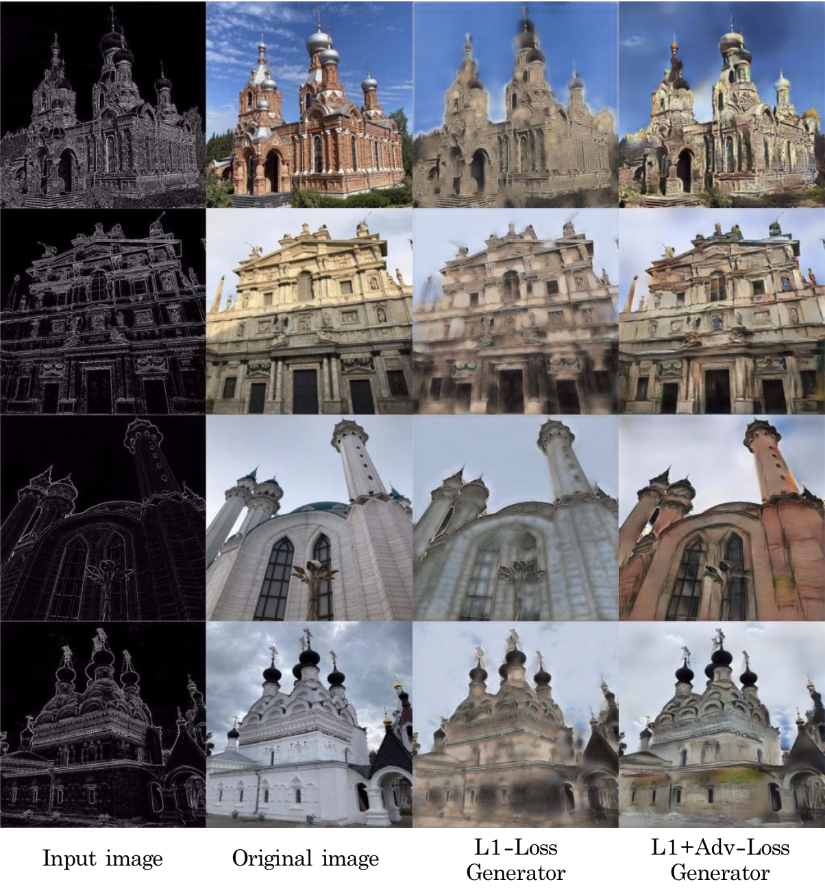

# Pix2Pix: Image-to-Image Translation with Conditional GANs

Original Pix2Pix paper: <https://phillipi.github.io/pix2pix/>

## Generator architecture

Generator is a U-Net like network, the architecture is demonstrated in the picture:



## Datasets

Data downloading script `scripts/download_data.sh` supports four classical Pix2Pix datasets: **facades**, **maps**, **edges2shoes** and **night2day**. There is also an additional dataset **churches**: [download link](https://yadi.sk/d/tYn_7I8kR2MpWg). I have collected this dataset on my own. The dataset is organized in accordance with classical Pix2Pix datasets. Each pair contains a photo of a building itself and the edges of the photo. There are 250 training and 50 testing pairs. 

## Training

Running `main.py` starts training with the configuration stored in `config.py` file

```bash
python main.py
```

The training process can be observed in these gifs:

  

## Results

### Facades dataset



### Maps dataset



### Churches dataset


